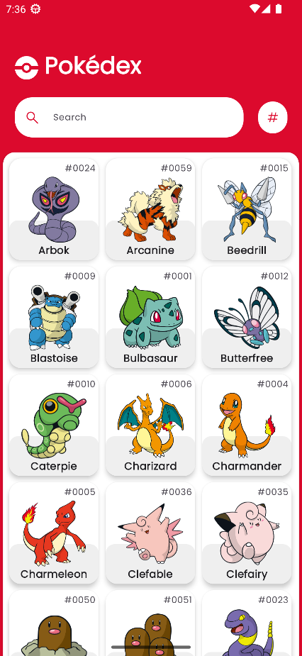
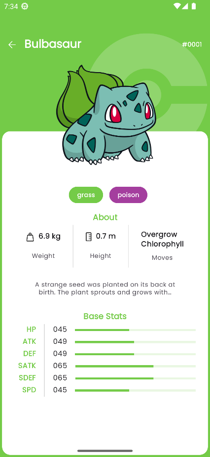

# Pokedex

    

### About
Finishing project of 2023 Pazarama Bootcamp.
Pokedex demonstrates modern Android development with Hilt, Coroutines, Flow, ViewModel, and Material Design based on MVVM architecture.
Uses <a href="https://pokeapi.co">Pokeapi.co</a> API

## Screenshots

  
  

### Architecture
MVVM Multi-Module Architecture by Layer

### Used technologies, tools and libraries
* <a href="https://kotlinlang.org">Kotlin 1.8.10</a>
* <a href="https://developer.android.com/studio">Android Studio Giraffe</a>
* <a href="https://developer.android.com/kotlin/flow">Flows</a>
* <a href="https://developer.android.com/kotlin/coroutines">Coroutines</a>
* <a href="https://developer.android.com/build/migrate-to-catalogs">Gradle Version Catalogs</a>
* <a href="https://developer.android.com/topic/libraries/architecture/paging/v3-overview">Paging 3</a>
* <a href="https://developer.android.com/guide/navigation">Jetpack Navigation</a>
* <a href="https://developer.android.com/training/dependency-injection/hilt-android">Hilt Dependency Injection</a>
* <a href="https://square.github.io/retrofit/">Retrofit</a>
* <a href="https://coil-kt.github.io/coil/">Coil</a>
* <a href="https://developer.android.com/develop/ui/views/launch/splash-screen">Splash Screen</a>

### Unit Tests
* <a href="https://github.com/cashapp/turbine">Turbine for Flows</a>
* <a href="https://github.com/google/truth">Truth for Assertion</a>
* <a href="https://androidx.tech/artifacts/paging/paging-testing/">Paging Test</a>
* <a href="https://site.mockito.org/">Mockito</a>

